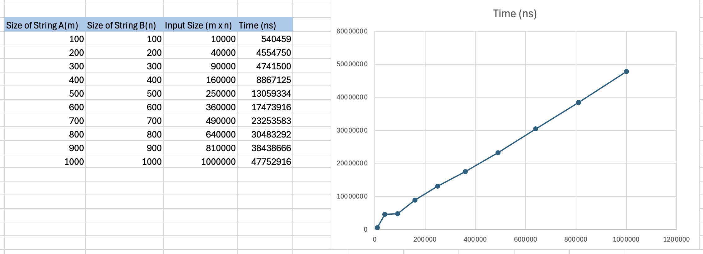

# COP4533-DynamicProgramming
**Students:**

Heiryn Hernandez Rojas - 90988659

Maite Chapartegui - 54536135

## Files
Within src folder:
* `opt.cpp` - has the input and opt dynamic programming algorithm which basically finds the common substring that maximizes total value of characters within said substring

Within data folder:
* `examplen.txt`: Different input files with a variety of input numbers and capacities
* `examplen.out`: the output with the misses for each function
## Compilation
Our program is written in C++
To compile the code,

1. Clone the repo on your device:
* git clone https://github.com/maitechapartegui/COP4533-DynamicProgramming.git

2. Compile in VSCode (or IDE of your choosing) terminal
* g++ -std=c++17 ./src/opt.cpp -o opt
* ./opt ./data/example100.in
- to change input file, just edit the path in the second command

## Assumptions

## Written Component

### Question 1: Empirical Comparison
Using the C++ <chrono> library:
- We placed the timers immediately before and after the core function for loop to capture only the execution time of the dp algorithm, specifically excluding the time spent on file I/O (input/output).
  This was done with code like:
    - `auto start = chrono::high_resolution_clock::now();`
    - `auto end = chrono::high_resolution_clock::now();`
    - `auto duration = chrono::duration_cast<chrono::nanoseconds>(end - start);`

 

